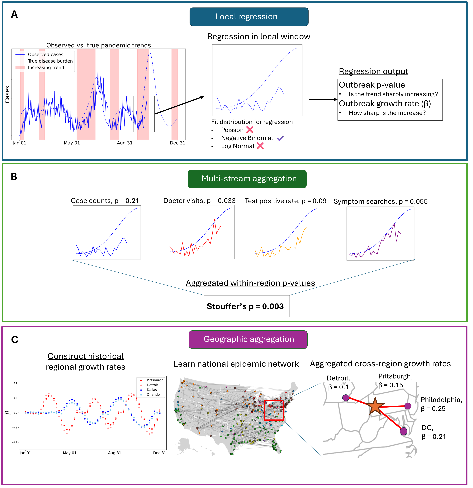

## LRTrend

**LRTrend** is a method for detecting outbreaks and uptrends in real time. Given one or more public health data streams (such as case counts, deaths, search trends, etc.) LRTrend will detect if the estimated growth rate is exceedingly high within a recent window, and can be done with multiple data streams to increase detection power. LRTrend can also learn cross-region epidemic similarity, constructing a disease-specific epidemic network, and aggregate across this network to further increase power.





## How to use LRTrend

### Installation

```bash
pip install -r requirements.txt
```

### Setup


---

## Citation
